Blume 以标准 Markdown 和 MDX 为基础，提供一套精选过的 GitHub 风格特性 —— 无需 import，无需配置。像平时一样写内容即可；本页展示了所有受支持的语法，每一项都配有实时预览和对应源码。

## 标题 [#headings]

用标题组织页面结构。Blume 会把 frontmatter 的 `title` 渲染为页面标题，所以正文从 `##` 开始 —— `##` 和 `###` 会成为目录中的条目。`##`–`######` 的每个标题还会被包在一个指向自身锚点的链接里，因此读者可以点击标题来复制、收藏，或分享直达该小节的永久链接（悬停时会显出 `#`）。在 `blume.config.ts` 中设置 `markdown: { headingAnchors: false }` 可关闭这一行为。

```md
## Section

### Subsection

#### Detail
```

### 自定义锚点 [#custom-anchors]

锚点 id 由标题文本生成，所以标题一旦改写，锚点也会跟着变。改为在末尾追加 `[#custom-id]`，就能把锚点固定下来 —— 这个标记不会出现在渲染结果中，而且无论标题怎么写，链接都照常有效。固定锚点在[翻译语言版本](/docs/content/i18n/)中也会保持一致，而自动生成的 id 原本会因语言而异。

```md
## Getting started [#setup]
```

按 `/page#setup` 链接到它。这个语法与 Fumadocs 一致，迁移过来的内容可以原样使用。

Pandoc、kramdown 以及基于 Markdown 的规范工具链所用的 `{#custom-id}` 写法，在 `.md` 文件里同样被接受为等价形式。而在 `.mdx` 里，裸写的 `{…}` 会被当成 JSX 表达式，页面将无法编译 —— `blume check` 会把这个标记报告为 `BLUME_MDX_CURLY_ANCHOR` —— 所以请在 `.mdx` 中写 `[#custom-id]`，或者把花括号转义。转义写法在两种格式里都会固定同一个锚点，因此对于被 `.mdx` 页面[引入](/docs/content/includes/)的片段来说，它是正确的拼写方式：

```md
## Getting started \{#setup\}
```

片段链接也可以指向带 `id` 的原生 HTML 元素（`<a id="setup"></a>`）；`blume validate` 既接受标题锚点，也接受这类写法。

### 目录标记 [#table-of-contents-markers]

还有两个位于标题末尾的标记，用来控制标题在目录中的呈现方式。`[!toc]` 让标题保留在正文中、但不出现在目录里；`[toc]` 则相反 —— 标题只出现在目录中，作为一个不可见的锚点目标，这适合给由组件而非正文构成的小节命名。标记可以按任意顺序叠加使用。有一个例外，这沿袭自 CommonMark：如果某个末尾方括号里的标签在页面任意位置存在链接引用定义（`[toc]: /url`），它就是快捷引用链接而不是标记，会原样留在标题文本中。

```md
## Appears on the page only [!toc]

## Appears in the TOC only [toc]

## Both markers together [toc] [#custom-id]
```

标记总是会被解析 —— 标题若恰好以形似标记的文字结尾，就会被当作加了标记。用反斜杠转义没有用（Markdown 在解析标记之前就已把 `\[` 解析成 `[`）；若要在标题末尾原样显示标记文字，请用行内代码包起来：`` ## 使用 `[toc]` ``。

## 强调 [#emphasis]

用于强调词语、标记删除，以及在句子中间展示代码或按键。

**粗体**、_斜体_、~~删除线~~ 和 `行内代码`。

```md
**Bold**, _italic_, ~~strikethrough~~, and `inline code`.
```

## 键盘按键 [#keyboard-keys]

用于快捷键和按键输入。`<kbd>` 元素会渲染成与搜索对话框所用的按键徽标相同的带边框样式，在 Markdown、MDX 中以及 `<Steps>`、`<Callout>` 这类组件内部都可用。

按 <kbd>⌘</kbd> <kbd>K</kbd> 打开搜索，或按 <kbd>Esc</kbd> 关闭。

```md
Press <kbd>⌘</kbd> <kbd>K</kbd> to open search, or <kbd>Esc</kbd> to close it.
```

## 上标与下标 [#superscript-and-subscript]

用于脚注标记、序数，以及科学或化学记号。

E = mc^2^ 与 H~2~O。

{/* prettier-ignore */}
```md
E = mc^2^ and H~2~O.
```

## 引用块 [#blockquotes]

把引文、提示框旁注或编者按与周围正文区分开。

> 快、AI 友好、零配置的文档 —— 连模板都是如此。

```md
> Documentation that's fast, AI-ready, and zero-config — down to the template.
```

## 列表 [#lists]

无序集合用无序列表，有先后顺序的序列用有序列表，清单和路线图用任务列表。

- 以 Markdown 为先的写作方式
- 默认输出静态站点
  - 按需启用服务端特性
- 产出归你所有

1. 安装 Blume
2. 写一个页面
3. 发布上线

- [x] 搭建项目骨架
- [ ] 写第一篇指南

```md
- Markdown-first authoring
- Static by default
  - Opt into server features
- Own your output

1. Install Blume
2. Write a page
3. Ship it

- [x] Scaffold the project
- [ ] Write the first guide
```

## 表格 [#tables]

把结构化数据整理成表格 —— 配置项、对比矩阵、参数列表。在分隔行里用冒号来对齐列。

| 命令          | 说明                 | 输出     |
| ------------- | -------------------- | :------: |
| `blume dev`   | 启动开发服务器       |    —     |
| `blume build` | 构建静态站点         | `dist/`  |

```md
| Command       | Description           | Output  |
| ------------- | --------------------- | :-----: |
| `blume dev`   | Start the dev server  |    —    |
| `blume build` | Build the static site | `dist/` |
```

如果要做一个没有表头的表格 —— 比如键值对 —— 把表头单元格留空即可。Markdown 在语法上要求存在表头行和分隔行，但 Blume 会从渲染结果中去掉这个空表头。

```md
|                |          |
| -------------- | -------- |
| Current status | E-3 visa |
```

## 链接与图片 [#links-and-images]

链接到其他页面或外部站点。图片可以写内容文件旁边的相对路径、`public/` 下的任意路径（在站点根路径下提供），或远程 URL。

相对页面链接（`./install`、`../guides/setup`）从该页面自身所在的文件夹解析 —— 对于索引页，就是它所引入的那个文件夹 —— 而指向 Markdown 文件的链接（`./setup.md`、`../intro.mdx`）会落到该文件所发布的页面，并带上它的 `slug`。带点的页面名（例如 `node.js.mdx` 页面写作 `./node.js`）只要在那里发布了页面，就算作页面链接；组件上的字符串 `href`（`<Card href="./install">`）也按同样的方式解析。Blume 会把每一条都写成构建后页面中的根相对路由，所以为 GitHub 或 Docusaurus 编写的链接依然有效，[`blume validate`](/docs/cli/validate/) 也用同样的规则来检查它们。

先阅读[快速上手](/docs/quickstart/)开始吧。

```md
Read the [quickstart](/docs/quickstart) to get started.


```

外部链接默认在当前标签页打开。在 `blume.config.ts` 中设置 `markdown: { externalLinks: true }` 就能让它们在新标签页打开 —— Blume 的页头和侧边栏链接已经这样做了：每一条绝对的 `https://` 或 `//host` 链接都会加上 `target="_blank"` 和 `rel="noreferrer"`、在文字后加一个小箭头，并附一条供屏幕阅读器识别的说明，提示它会在新标签页打开。指向你自己页面的链接、`#片段` 以及 `mailto:`/`tel:` 链接仍留在当前标签页，原生 `<a>` 标签也一样 —— 它会保留你写下的属性。

**本地图片请优先使用相对路径** —— 它们会在构建时完成优化：压缩、转换为 WebP，并写入图片自身的 `width`/`height`，这样页面加载时不会发生位移。把图片放在使用它的页面旁边（或放在内容目录下某个共享文件夹里），并用相对路径引用：

```md

```

`public/` 下的绝对路径（``）会原样提供、不做任何优化 —— 请把它留给必须保持字节和 URL 完全一致的文件，比如文档之外引用的 logo。远程图片同样原样透传，除非它们的主机在 [`image` 配置](/docs/configuration/)中被授权。

正文图片默认可以点击放大 —— 读者点击任意一张图都能在灯箱中打开。在 `blume.config.ts` 中设置 `markdown: { imageZoom: false }` 可关闭这一行为，也可以在单张图片上用 `data-no-zoom` 选择退出。

## 分隔线 [#horizontal-rule]

在长页面中分隔主题的大幅转换。

---

```md
---
```

## 代码块 [#code-blocks]

围栏代码块带语法高亮，页眉会显示语言 —— 已知语言还会带品牌图标 —— 并提供复制按钮。在语言之后加一个**标题**（通常是文件名），它会替换页眉中的语言标签。

```ts blume.config.ts
import { defineConfig } from "blume";

export default defineConfig({
  title: "My docs",
});
```

````md
```ts blume.config.ts
import { defineConfig } from "blume";

export default defineConfig({
  title: "My docs",
});
```
````

行内代码同样可以高亮：在反引号跨度里加上 `{:lang}` 标记，它就会像一小段代码块那样着色 —— 例如 `useState(){:js}` 或 `T extends object{:ts}`。只有你加上标记时它才会生效，因此普通的行内代码不受影响 —— 无需任何开关。

高亮默认使用 `github-light`/`github-dark` 主题。用 `markdown.code.theme` 可以按色彩模式换成任意一个[内置 Shiki 主题](https://shiki.style/themes) —— 它会一次性为所有代码表面着色（围栏、行内片段、`<CodeBlock>` 和 `<Diff>`）：

```ts blume.config.ts
export default defineConfig({
  markdown: {
    code: {
      theme: { light: "github-light", dark: "vesper" },
    },
  },
});
```

你也可以直接提供自定义的 [Shiki 主题定义](https://shiki.style/guide/load-theme)。导入一个兼容 VS Code 的主题 JSON 文件（如果运行时要求，就使用 import attribute），再把它赋给任一色彩模式；内置名称与自定义定义可以混用：

```ts blume.config.ts
import darkTheme from "./themes/acme-dark.json" with { type: "json" };

export default defineConfig({
  markdown: {
    code: {
      theme: { light: "github-light", dark: darkTheme },
    },
  },
});
```

### 行号 [#line-numbers]

追加 `lineNumbers` 可以渲染行号栏 —— 单独使用，或与标题一起使用：

```ts server.ts lineNumbers
import { createServer } from "node:http";

createServer().listen(3000);
```

````md
```ts server.ts lineNumbers
import { createServer } from "node:http";

createServer().listen(3000);
```
````

### 长行与长代码块 [#long-lines-and-long-blocks]

追加 `wrap` 可以让单个代码块里的长行自动换行，而不是横向滚动：

```ts client.ts wrap
const client = createClient({
  baseUrl: "https://api.example.com/v1",
  retries: 3,
  timeout: 10_000,
  headers: { "x-client": "docs" },
});
```

````md
```ts client.ts wrap
const client = createClient({
  baseUrl: "https://api.example.com/v1",
  retries: 3,
  timeout: 10_000,
  headers: { "x-client": "docs" },
});
```
````

给较长的代码块追加 `expandable`，会先显示它的前几行，下方配一个**展开更多**开关。展开后代码块完整显示，内部不会出现滚动。少于 16 行的代码块按常规渲染，因为几乎没内容可藏。

```ts routes.ts expandable
import { defineRoutes } from "./router";

export default defineRoutes({
  home: "/",
  docs: "/docs",
  guides: "/docs/guides",
  reference: "/docs/reference",
  changelog: "/changelog",
  blog: "/blog",
  pricing: "/pricing",
  about: "/about",
  careers: "/careers",
  contact: "/contact",
  privacy: "/legal/privacy",
  terms: "/legal/terms",
  security: "/security",
  status: "https://status.example.com",
});
```

````md
```ts routes.ts expandable
import { defineRoutes } from "./router";

export default defineRoutes({
  // …every route
});
```
````

两者都可以与标题和 `lineNumbers` 一起使用。若想让所有代码块都换行，改为设置 `markdown.code.wrap`。

### 高亮 [#highlighting]

用 GitHub 风格注释标注代码，可以把注意力引向特定的行、词和改动。这些注释会从渲染结果中剥离，因此代码复制粘贴后依然干净。以下四种全部默认开启 —— 无需配置。

用 `// [!code highlight]` 标记某一行，为它加上高亮背景：

```ts
const config = defineConfig({
  title: "My docs", // [!code highlight]
});
```

用 `// [!code ++]` 表示新增、`// [!code --]` 表示删除，渲染为绿/红色的 diff：

```ts
export default defineConfig({
  title: "My docs", // [!code --]
  title: "Blume docs", // [!code ++]
});
```

用 `// [!code word:createServer]` 高亮该行中某个词的每一处出现：

```ts
import { createServer } from "node:http"; // [!code word:createServer]

createServer().listen(3000);
```

用 `// [!code focus]` 标记的行保持清晰，其余内容全部变暗（悬停时恢复锐利）：

```ts
export default defineConfig({
  title: "My docs", // [!code focus]
  description: "Built with Blume",
});
```

也可以按**行号**而不是按注释来高亮 —— 在你无法编辑代码时这很有用。在语言之后写一个花括号范围；单行、逗号列表和 `start-end` 区间都可以：

```ts {1,4-5}
import { defineConfig } from "blume";

export default defineConfig({
  title: "My docs",
  description: "Built with Blume",
});
```

````md
```ts {1,4-5}
import { defineConfig } from "blume";

export default defineConfig({
  title: "My docs",
  description: "Built with Blume",
});
```
````

### 类型展示 [#display-types]

给 TypeScript 代码块加上 `twoslash` 标记，即可直接展示编译器给出的真实类型 —— 由 [Twoslash](https://shiki.style/packages/twoslash) 提供支持。把鼠标悬停在任意 token 上即可查看推断出的类型；再补一条行内 `^?` 查询，就能把某个类型钉在该行下方。

```ts twoslash
const config = {
  title: "My docs",
  version: 1,
};

config.title;
//     ^?
```

````md
```ts twoslash
const config = { title: "My docs", version: 1 };

config.title;
//     ^?
```
````

### TypeScript 与 JavaScript 标签页 [#typescript-and-javascript-tabs]

给 `ts` 或 `tsx` 代码块加上 `ts2js` 标记，就会把它渲染成一对标签页：你的 TypeScript 与自动生成的 JavaScript 版本并列展示，你只需维护一份代码片段，读者自选方言。转换会去掉类型语法和纯类型导入，同时完整保留你的格式、注释和 JSX —— 而且标签页是同步的，所以在页面上任意一处切到 JavaScript，所有代码块对都会一起切换。和图表、数学公式一样，这是仅 MDX 可用的特性 —— 在 `.md` 文件中，该代码块会渲染为普通的 TypeScript 围栏。

```ts ts2js
import { defineConfig } from "blume";

interface Author {
  name: string;
}

const author: Author = { name: "Hayden" };

export default defineConfig({
  title: `${author.name}'s docs`,
});
```

````md
```ts ts2js
import { defineConfig } from "blume";

interface Author {
  name: string;
}

const author: Author = { name: "Hayden" };

export default defineConfig({
  title: `${author.name}'s docs`,
});
```
````

其他围栏元信息可以组合使用：`title="..."` 会在两个标签页上都显示，而 `{1,4-5}` 这样的行号范围只作用于 TypeScript 标签页（去掉类型后行号会偏移）。唯一的例外是 `twoslash` —— 悬停类型无法带到生成的代码里，因此同时标注两者的代码块仍然是普通的 Twoslash 代码块。

:::note
在 `blume.config.ts` 中设置 `markdown: { code: { icons: false, wrap: true } }`，可以隐藏语言图标，或让长行换行而不是横向滚动。
:::

## 包安装 [#package-install]

`package-install` 代码块能把一条安装命令变成 npm、pnpm、yarn、bun、nub 和 aube 六种选项卡形式的代码片段 —— 读者复制与自己的环境匹配的那一条即可。和图表、数学公式一样，这是仅 MDX 可用的特性 —— 在 `.md` 文件中，该代码块会渲染为普通的代码围栏。

```package-install
npm i blume
```

````md
```package-install
npm i blume
```
````

## 图表 [#diagrams]

`mermaid` 代码块可以直接从文本渲染出 [Mermaid](https://mermaid.js.org) 图表。围栏内的内容会原样传给 Mermaid，因此 Mermaid 支持的任何图表类型在这里都能用。图表会跟随当前色彩主题，并在主题变化时重新渲染。用 `mermaid` 围栏包住源码即可编写：

````md
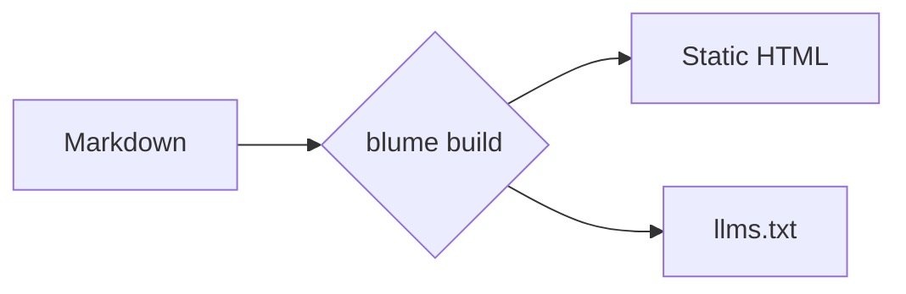
````

图表在客户端渲染，因此这是仅 MDX 可用的特性；而且 Mermaid 库只会在包含图表的页面上加载 —— 站点里没有图表就完全不会带上它。图表默认使用 Mermaid 的 dagre 布局和 classic 外观；要让单个图表改用其他布局或外观，可以通过 Mermaid front matter（一个带 `layout: elk` 或 `look: neo` 的 `config:` 块）来选择，而 ELK 引擎也只会为需要它的图表加载。本节其余部分是常见类型的图库 —— 完整列表请见 [Mermaid 文档](https://mermaid.js.org/intro/)。

### 流程图 [#flowchart]


### 时序图 [#sequence-diagram]

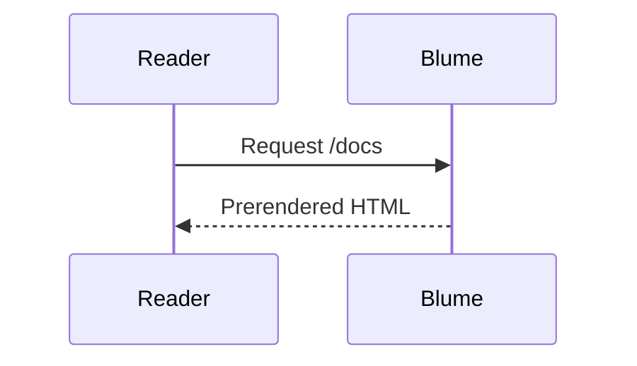

### 类图 [#class-diagram]

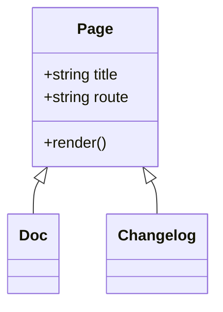

### 状态图 [#state-diagram]

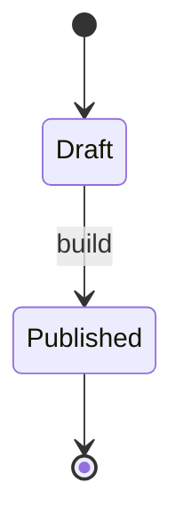

### 实体关系图 [#entity-relationship]

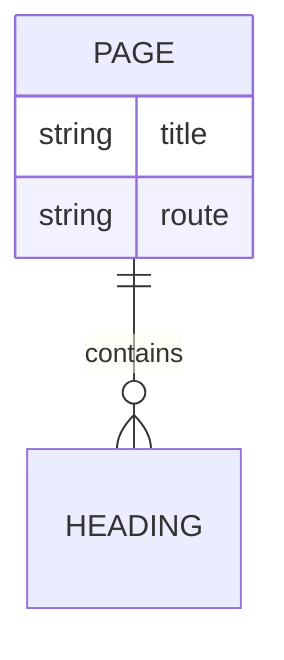

### 用户旅程图 [#user-journey]

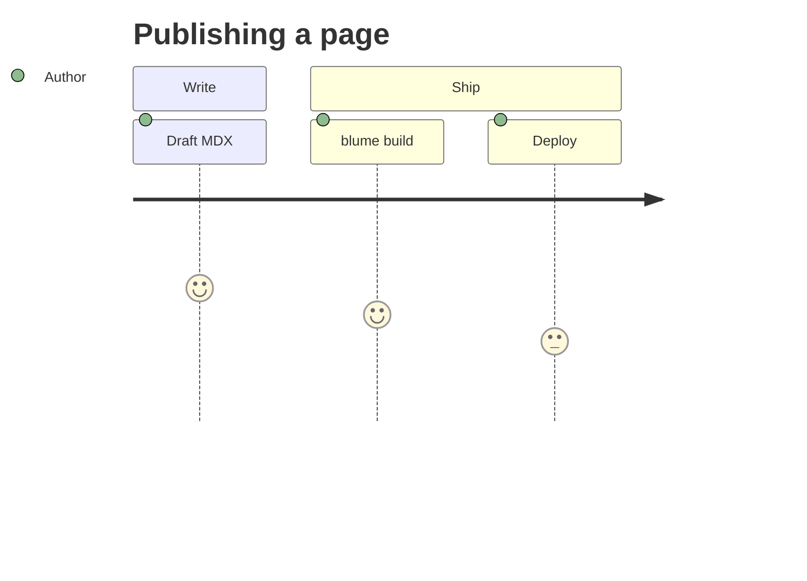

### 甘特图 [#gantt]

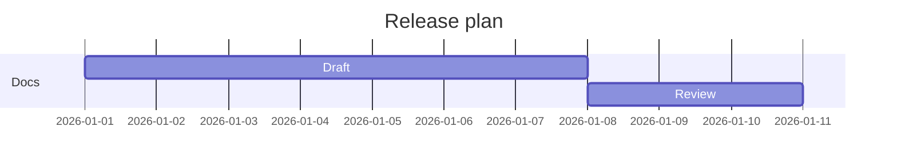

### Git 提交图 [#git-graph]

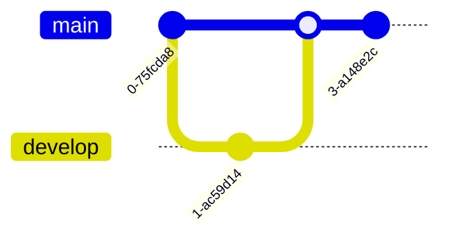

### 饼图 [#pie-chart]

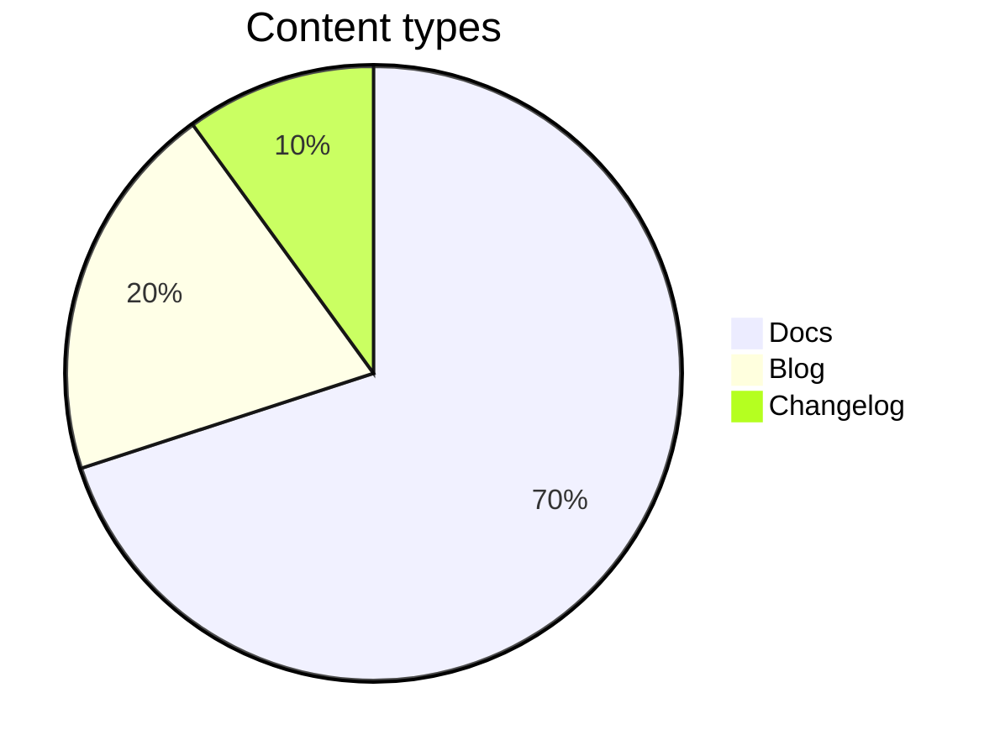

### 思维导图 [#mindmap]

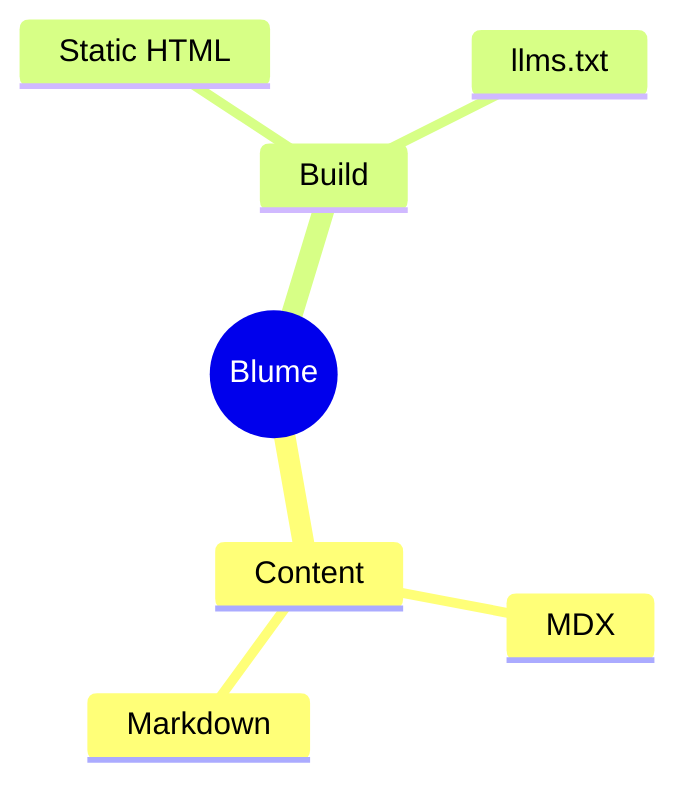

### 时间线 [#timeline]

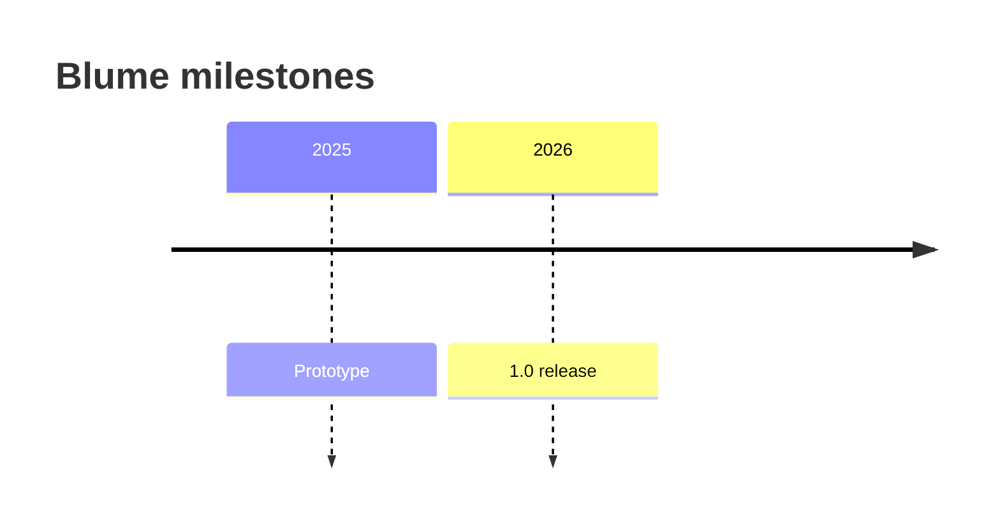

## 提示框 [#callouts]

提示框用于把读者的注意力引向背景信息、建议或风险。写作时使用 `:::type` 指令；可以在方括号里加一个标题，比如 `:::warning[注意]`。这些指令是仅 MDX 可用的特性 —— 在 `.md` 文件里，`:::note` 这一行只会保留为普通文本。

### Note [#note]

中性的补充背景，读者应当留心记住。

:::note
Blume 每次运行都会重新生成 `.blume/` —— 切勿手动编辑它。
:::

```md
:::note
Blume regenerates `.blume/` on every run — never edit it by hand.
:::
```

### Tip [#tip]

不是必需、但能让事情更轻松的便捷技巧或最佳实践。

:::tip
设置 `deployment.site`，让站点地图和 Open Graph 图片使用绝对 URL。
:::

```md
:::tip
Set `deployment.site` so sitemaps and Open Graph images use absolute URLs.
:::
```

### Success [#success]

确认一个正向结果，或确认某一步已按预期完成。

:::success
你的文档构建成功，可以部署了。
:::

```md
:::success
Your docs built successfully and are ready to deploy.
:::
```

### Warning [#warning]

标出需要小心处理的地方，以免出错或出现意外行为。

:::warning[注意]
服务端输出需要先从 `blume/deploy` 引入一个宿主适配器才能部署。
:::

```md
:::warning[Heads up]
Server output needs a host adapter from `blume/deploy` before you can deploy.
:::
```

### Danger [#danger]

指出破坏性、或会造成不兼容变更且难以撤销的操作。

:::danger
`blume eject` 是一条单行道 —— 生成的 Astro 项目从此归你所有。
:::

```md
:::danger
`blume eject` is a one-way step — the generated Astro project becomes yours.
:::
```

### Info [#info]

信息性的旁注；一个便于用别名替代、语气中立的默认选项。

:::info
核心主题不包含任何客户端框架 JS。
:::

```md
:::info
The core theme ships no client framework JS.
:::
```

`caution`、`error`、`important` 和 `warn` 这几个名字会分别作为 `warning`、`danger`、`note` 和 `warning` 的别名被接受。

其它名字则不是提示框。它的内容照样会渲染 —— 位于那两行 `:::` 之间，而这两行会按原样留在页面上 —— 所以从别的文档工具沿用过来的 `:::details`，或像 `:::warnig` 这样的拼写错误，都不会把里面的内容藏起来。`blume dev`、`blume build` 和 `blume check` 会以 `BLUME_UNKNOWN_DIRECTIVE` 提示这一点，并列出上面那些提示框类型。

要把一个提示框放进另一个里面，就把外层的围栏加长：

```md
::::note
Blume regenerates `.blume/` on every run.

:::tip
Commit `blume.config.ts`, not `.blume/`.
:::
::::
```

## 数学公式 [#math]

用 KaTeX 渲染 LaTeX，适合数学公式密集或偏科学的文档。把 `$$…$$` 单独放在一行，可以得到居中的块级公式：

$$
\int_0^\infty e^{-x^2}\,dx = \frac{\sqrt{\pi}}{2}
$$

```md
$$
a^2 + b^2 = c^2
$$
```

或者把 `$$…$$` 写在句子中间，用作行内公式，比如欧拉恒等式 $$e^{i\pi} + 1 = 0$$：

```md
Like Euler's identity $$e^{i\pi} + 1 = 0$$.
```

:::note
数学公式是自动开启的：写了 `$$…$$` 就会渲染，一个不写就绝不会加载 KaTeX 的样式表。块级公式和行内公式都用两个美元符号。单个 `$`（货币、shell 变量、代码）永远按字面文本处理，所以 "$5 and $10" 不会被当成公式；也不需要转义定界符，更没有开关可切。数学公式是仅 MDX 可用的特性。渲染出的标记里的类名（`.katex-html`、`.katex-base` 等）是 KaTeX 自身的内部实现，而不是 Blume 承诺保持稳定的样式契约 —— 它们可能随 KaTeX 升级而变化，所以自定义样式请作用在 `.katex-display` 外层上。
:::

## 智能标点 [#smart-punctuation]

Blume 会在你写作时把直角引号和连字符转换成排印符号中对应的字符，因此正文读起来像是经过排版 —— 无需任何特殊字符。

"引号" 会变成弯引号，-- 变成连接号（en dash），--- 变成破折号（em dash），... 变成省略号。

```md
"Quotes" become curly, -- becomes an en dash, --- an em dash, and ... an ellipsis.
```